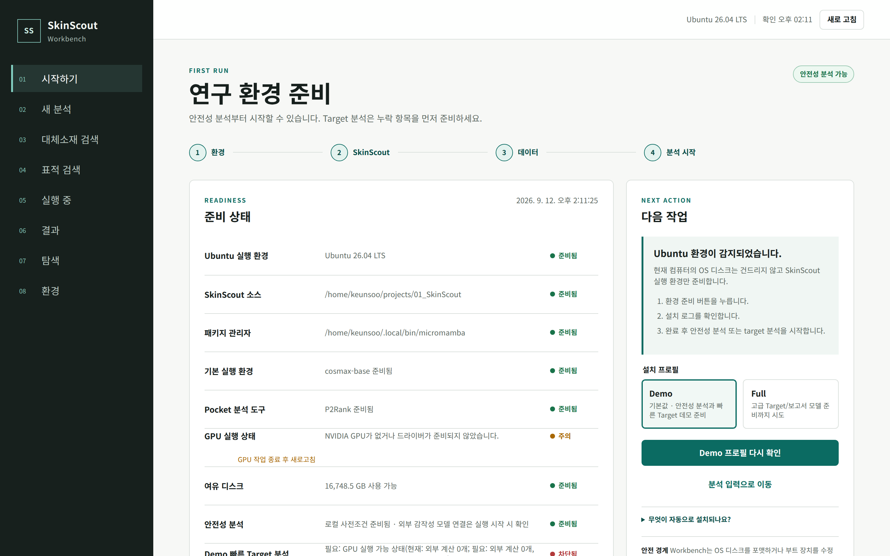
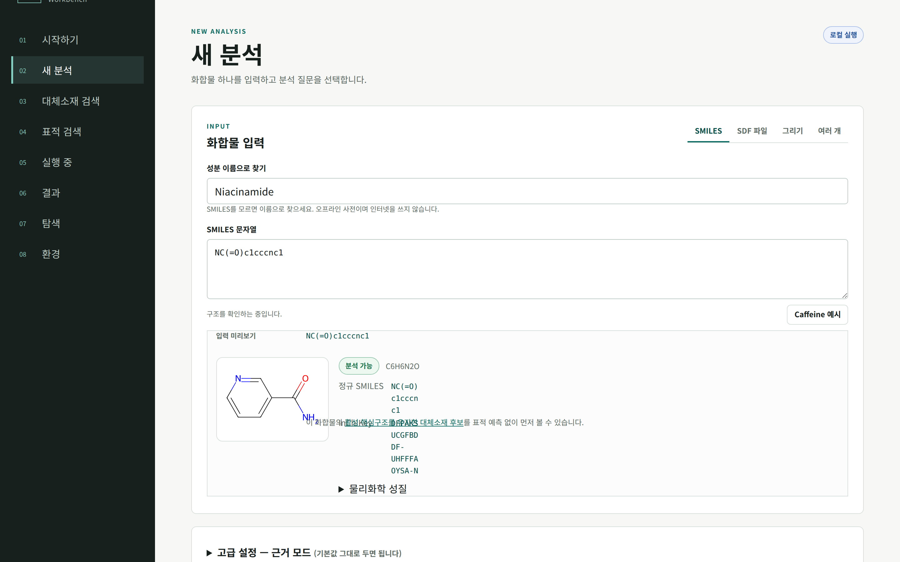
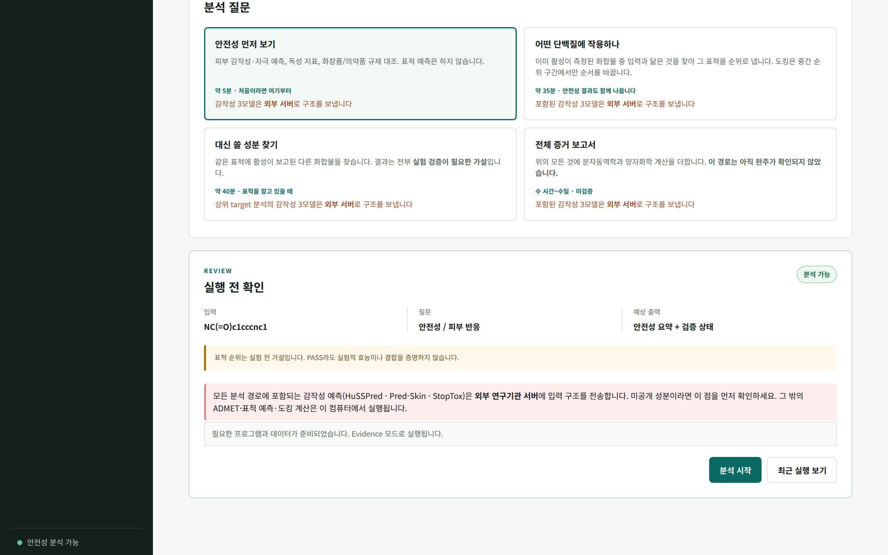
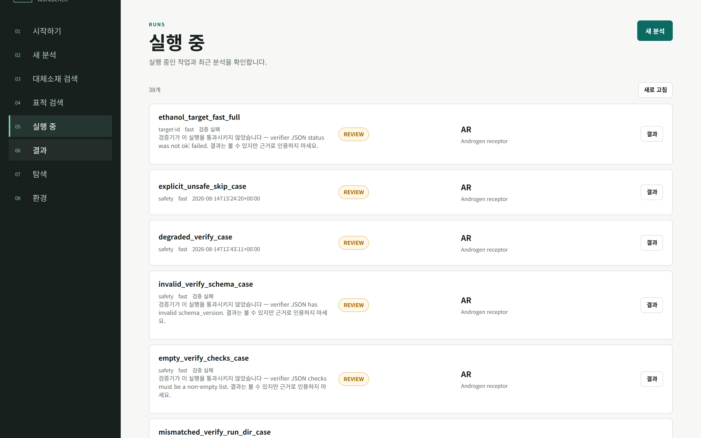
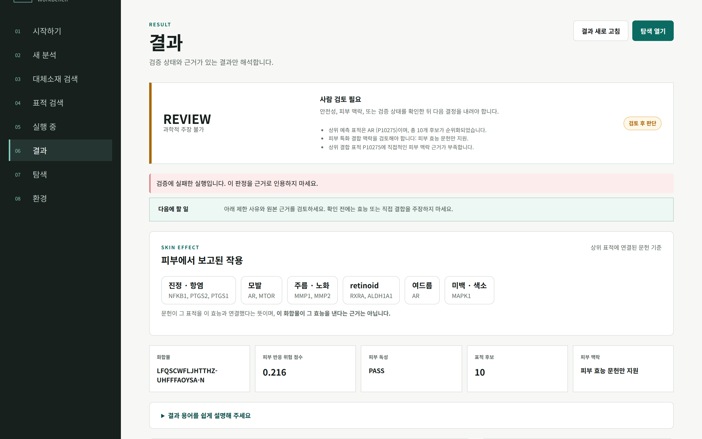
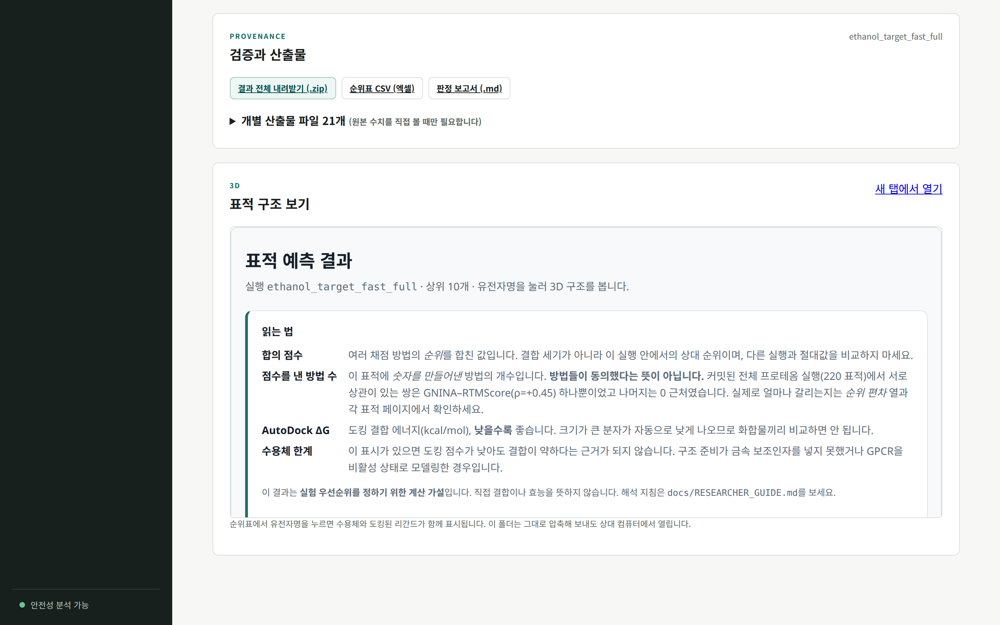
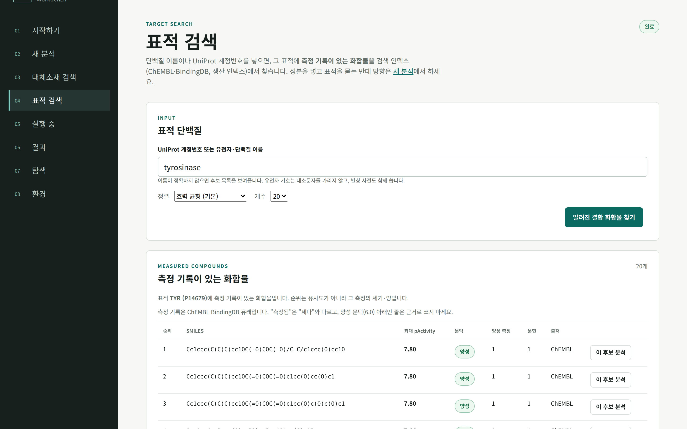
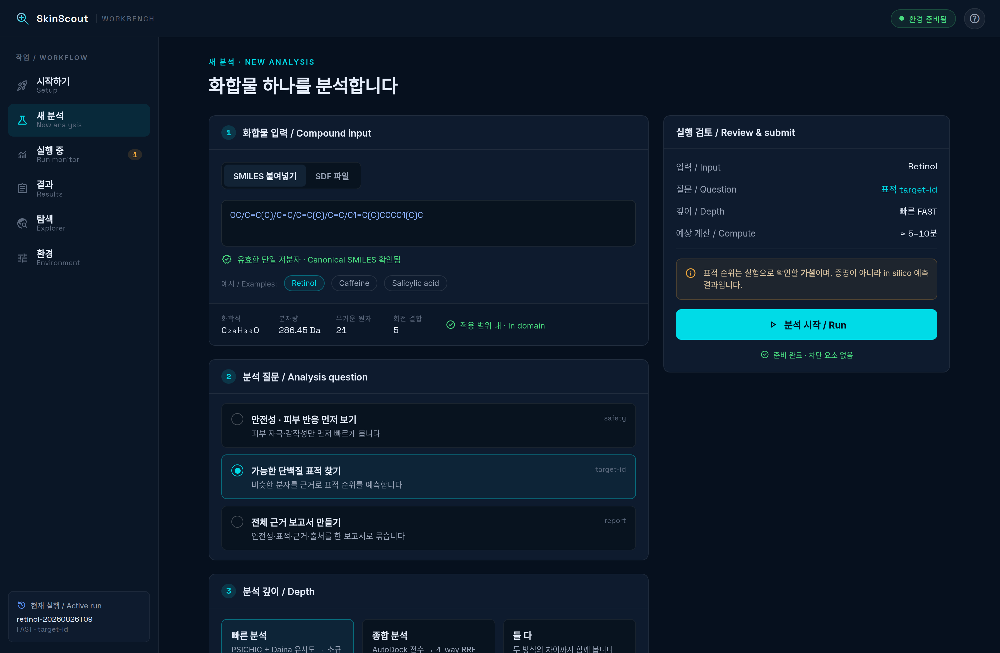
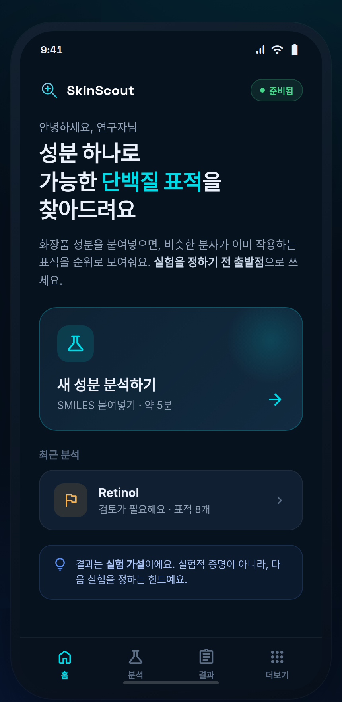
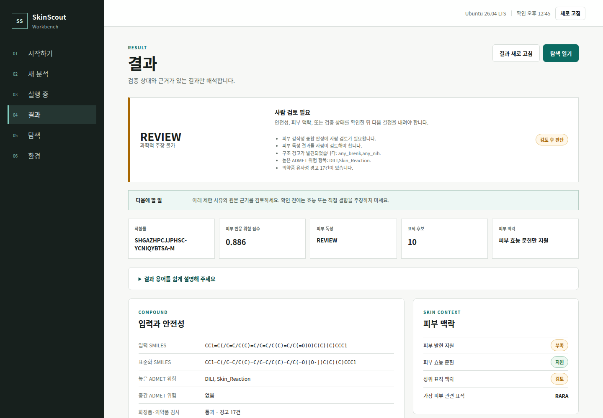

# SkinScout

**성분 하나 넣으면 어떤 사람 단백질에 붙을지 순위로 보여줍니다.**

Linux도 conda도 몰라도 됩니다. 설치는 명령 한 줄이고 나머지는 브라우저에서 합니다.

---

> **이 저장소는 공개본입니다.** 개인 알림 스크립트 하나와 작업용 검토 덤프 두 개를
> 뺐습니다. 앞의 것에는 수신 주소와 호스트 정보가, 뒤의 것에는 대부분 이미 고친 결함
> 목록이 들어 있어서 그대로 읽으면 오해하기 쉽습니다. 저장소를 만든 과정을 적은 내부
> 개발 문서 세 개도 뺐습니다 - 도구 설명이 아니라 작업 기록입니다.
>
> 코드와 문서는 전부 그대로 두었습니다. 다만 제3자 데이터베이스에서 가져온 패널·벤치마크
> 데이터(차가운 패널, 전이 측정 쌍, 리랭크 진실값, 감작 벤치마크, PubChem Probe 캐시)는
> 원천 라이선스 때문에 공개본에서 뺐습니다. 이 저장소의 Apache-2.0만으로는 그 데이터까지
> 함께 배포할 수 없기 때문입니다. 빠진 패널은 문서에 적어 둔 원천에서 다시 만들면 됩니다.
> `docs/` 아래 감사 보고서도 뺐다가 다시 넣었는데, 이 도구가 무엇을 못 하는지 적어둔
> 문서라 빠지면 오히려 곤란합니다.

## 실험 연구자라면 여기부터

표적 목록에서 실험팀에 전달할 후보를 검토하려면
[표적 목적 기반 분석·인계 안내](docs/TARGET_FIRST_HANDOFF.md)를 보세요.
원본 31개 항목의 상태, 기능 방향, 문헌 근거, 현재 안전성 판정과 실험안을 함께 제공합니다.

### 어떻게 생겼나 — 실제 화면

아래는 목업이 아니라 **돌아가는 프로그램을 그대로 찍은 것**입니다. 쓰는 순서대로입니다.
(`python scripts/capture_workbench_screenshots.py`로 언제든 다시 찍습니다.)

**1. 이 컴퓨터에서 뭘 돌릴 수 있는지 먼저 보여줍니다**



**2. 성분 이름만 치면 구조가 바로 확인됩니다** — SMILES를 몰라도 됩니다



**3. 무엇을 물어볼지 고릅니다** — 각각 얼마나 걸리는지, 어디로 나가는지 적혀 있습니다



**4. 돌린 분석이 전부 남습니다** — 상태와 로그까지



**5. 결과는 판정부터** — 왜 그 판정인지 이유가 한글로 붙습니다



**6. 3D 구조는 화면 안에서 바로** — 따로 설치할 게 없습니다



### 안에서 무슨 일이 일어나나 — 현재 파이프라인

성분 하나를 넣고 "어떤 단백질에 작용하나"를 고르면 이 순서로 갑니다.
괄호 안은 실제로 도는 규칙 이름이라, 코드를 보실 때 그대로 찾으시면 됩니다.

```
INPUT   이름 · SMILES · 구조 그리기 · SDF (여러 개 가능)
  │
  ├─ ① 구조 정리 · 초 단위
  │     rdkit_standardize      염 제거 · 정규화
  │     dimorphite_protonate   pH 7.4 이온화        ← 도킹용
  │     etkdgv3_conformer      3D 좌표
  │     xtb_optimize           구조 최적화
  │                            ⇒ compound_canonical.sdf
  │
  ├─ ② 안전성 · 규제 · 1~2분
  │     admet_ai               ADMET 49종
  │     stoptox · husspred · pred_skin   ← 외부 서버로 구조 전송
  │     skin_sens_consensus    감작성 3모델 합의
  │     pains_brenk_filter     구조 경고
  │     cosing_match · drug_avoidance    화장품 · 의약품 대조
  │
  │     ┌─────────────────────────────────────────────┐
  │     │  HALT 이면 여기서 끝납니다. 표적 예측 안 함. │
  │     └─────────────────────────────────────────────┘
  │
  ├─ ③ 표적 검색 · 1~2분  ★ 순위는 여기서 만들어집니다
  │     daina_zoete            SDF → 중성화 → ECFP4 지문
  │                            검색 인덱스 조회
  │                            (ChEMBL 37 + BindingDB, 표적 4,873개)
  │                            레시피 union_discount_light 로 점수
  │     dti_rrf_fast           상위 256개 선별
  │
  ├─ ④ 구조 계산 · 20~30분  (11~50위 구간만)
  │     fast_autogrid_maps     표적별 격자
  │     autodock_top5k         GPU 도킹
  │     fast_gnina_pose_rescore   그 포즈를 재채점
  │     fast_band_rerank       기본값: 전체 검색 순위 보존
  │
  ├─ ⑤ 주석 · 초 단위  (순위를 바꾸지 않습니다)
  │     daina_structural_overlay   근거 · 구조 상태
  │     known_target_prior         실험 사전지식
  │     skin_weight_apply          피부 발현
  │     kg_efficacy_label          유전자·키워드 공출현 (문헌 검토 신호)
  │
  └─ ⑥ 판정 · 포장 · 1분
        summarize_run_outputs      판정 + 이유
        run_output_verification    계약 검증
        make_results_viewer        오프라인 3D 뷰어

OUTPUT  판정(PASS / REVIEW / HALT) + 그 이유
        표적 순위표 — 표적마다 근거 유사도 · 근거 세기 · 순위 기준
        3D 구조 뷰어 (인터넷 없이 열립니다)
        zip · CSV · 판정 보고서
```

몇 가지는 미리 알고 보시는 게 좋습니다.

**기본 순위는 ③에서 정해집니다.** 도킹은 11~50위 구간에 구조 근거를 더하고,
검색 순서를 유지합니다. `docking.fast_mode_rerank_enabled: true`로 실험적 재정렬을
명시적으로 켜면 설정된 구간만 바뀌며, 결과는 검토 필요·주장 불가로 표시됩니다.
결과 표의 `순위 기준` 열과 정책 상태에서 이를 확인할 수 있습니다.
[현재 recipe 검토](docs/CURRENT_RERANK_POLICY_REVIEW_20260914.md)에 근거와 한계를 기록했습니다.

**③은 계산이라기보다 조회입니다.** 활성이 이미 측정된 분자 중에 닮은 것을 찾고, 그
분자가 붙는 단백질을 가져옵니다. 결합을 새로 계산해 내는 게 아닙니다.

①에서 이온화했다가 ③에서 다시 중성으로 되돌리는 게 이상해 보일 수 있는데, 쓰는 데가
다릅니다. 도킹에는 pH 7.4의 실제 이온 형태가 맞고, 검색 쪽은 참조 데이터가 전부 중성
구조라 그쪽에 맞춰야 비교가 됩니다. 2026-08-31까지 이 둘이 어긋나 있었고, 그래서
하이드로퀴논이 자기 자신과 0.231로 나왔습니다.

②는 문지기 역할입니다. 감작성 세 모델이 `HALT`로 모이면 표적 예측은 시작도 하지
않습니다. 감작이 의심되는 성분은 표적이 무엇이든 후보로 올릴 이유가 없다고 봤습니다.

순위를 만드는 건 "얼마나 닮았나"이고 "그 측정이 얼마나 셌나"는 약하게만
들어갑니다. 그래서 표적마다 가장 가까운 근거가 활성 문턱 위였는지 아래였는지를 따로
적어 두고, 아래면 경고를 붙입니다. 알파-아르부틴을 넣어 보시면 1위 티로시나제에 이
경고가 붙는데, 실제로 약한 억제제라 그렇습니다.

`--mode comprehensive`를 쓰면 ④에 PSICHIC · RTMScore · Boltz-2가 더 붙고 4-way RRF로
합칩니다. 다만 네 방법의 순위 상관이 거의 없다는 것이 측정돼 있어(GNINA–RTMScore
ρ=+0.45 하나만 유의) 지금은 fast 경로가 기본입니다.

### 활성 핵심구조 유지형 대체소재

이 저장소가 맡은 과제의 정식 제목은 **「활성 핵심구조 유지형 대체소재 발굴 자동화 시스템 개발
연구의 건」**입니다. 위 파이프라인이 "이 성분이 어느 단백질에 붙나"를 묻는다면 제목은 반대 방향을
요구합니다. **활성이 알려진 화합물을 주면, 그 핵심구조를 유지한 채 쓸 수 있는 이미 등재된
화장품 원료를 골라냅니다.** 맡은 곳은 Workbench 왼쪽 `03` **대체소재 검색** 화면과 그것이 부르는
[`scripts/alternative_ingredients.py`](./scripts/alternative_ingredients.py) 둘뿐입니다. 표적
예측 없이 1초면 끝나고, 순위는 유사도가 아니라 **핵심구조 유지 등급**이 먼저입니다. 곁사슬만
닮아도 Tanimoto는 높게 나오기 때문입니다. 터미널에서도 같습니다 (레티놀).

```bash
python scripts/alternative_ingredients.py \
  --smiles 'CC1=C(/C=C/C(C)=C/C=C/C(C)=C/CO)C(C)(C)CCC1' --limit 10 --with-evidence
```

```text
CosIng 등재 37,071건 중 구조가 확인된 것은 10,120건이고, 같은 구조에 붙은 이름을 합치면 7,485종입니다. 나머지는 추출물·혼합물·고분자라 구조 비교의 대상이 아닙니다.
7,485종을 전부 대조해 핵심구조가 유지된 후보 2건을 찾았습니다.
  순위    유사도 핵심구조                  유지율    비중   고리  INCI
   1  0.714 핵심구조 그대로             1.00  0.88   일치  RETINYL ACETATE
       └ 측정됨: 표적 2개, 최대 pAct 5.91 (Q9Y6L6, Q9NPD5)
   2  0.603 핵심구조 그대로             1.00  0.55   일치  RETINYL PALMITATE
   3  0.441 일부 유지                0.95  0.49   일치  CI 75135
   4  0.409 거의 다름                0.48  0.91   일치  2,6,6-TRIMETHYLCYCLOHEXENE-1-CARBALDEHYDE
   5  0.333 거의 다름                0.48  0.71   일치  CIS-ROSE KETONE-2
   6  0.333 거의 다름                0.48  0.71   일치  TRANS-ROSE KETONE-2
   7  0.184 거의 다름                0.29  0.55    -  GERANIOL
   8  0.180 거의 다름                0.29  0.38    -  FARNESOL
       └ 측정됨: 표적 2개, 최대 pAct 6.1 (P27338, P22309)
   9  0.173 거의 다름                0.29  0.55    -  3,7-Dimethyl-2-octen-1-ol (6,7-Dihydrogeraniol), when us
  10  0.167 거의 다름                0.38  0.80   일치  2,4-DIMETHYL-3-CYCLOHEXENE-1-METHANOL
```

| 열 | 뜻 |
|---|---|
| `유사도` | ECFP4 Tanimoto. 같은 등급 안에서 줄을 세우는 데만 씁니다 |
| `핵심구조` | 판정 등급. `핵심구조 그대로`·`핵심구조 유지`까지가 유지된 것이고, `일부 유지`부터는 핵심이 이미 바뀌었습니다 |
| `유지율` / `비중` | 입력 중원자 중 후보 안에 남은 비율 / 후보가 그 공통 구조로 이루어진 비율. 뒤의 것이 작은 입력이 아무 큰 분자나 통과시키는 것을 막습니다. `고리`는 Bemis-Murcko 골격 일치 여부로 참고 지표입니다 |
| `종합 점수`·`구조/근거/안전`·`피부반응`·`logP`·`3D` | 점수는 세 축의 백분위 순위를 가중 평균(55/25/20)한 것으로 **확률이 아니라 줄 세우기입니다**(0.82가 82%가 아니고 가중치는 보정한 값이 아닙니다). 축 옆 `추정`은 쓸 값이 없어 중앙값으로 채웠다는 뜻이며 낮게 잰 것이 아닙니다. 피부반응·logP는 ADMET-AI(MIT) **예측이지 측정이 아니고**, `3D`는 **계산으로 만든 컨포머 하나**로 실험 구조도 결합 자세도 아닙니다. `└ 측정됨` | 그 원료 **자체**의 측정 기록이 이 도구의 활성 라이브러리(ChEMBL·BindingDB 유래 1,061,686종)에 있을 때만 붙습니다. 전체 InChIKey로 먼저 찾고, 자기 행이 없을 때만 연결성(앞 14자)으로 내려가며 그 경우 `연결성만 같은 분자의 값`이라고 함께 적습니다. 입력 화합물과 **같은 단백질에서** 재 본 기록까지 있으면 `└ 입력과 같은 표적에서도 측정됨` 줄이 하나 더 붙는데, 이 화면이 낼 수 있는 가장 결정에 가까운 근거입니다. **줄이 없는 것은 "활성이 없다"가 아니라 그 라이브러리에서 찾지 못했다는 뜻입니다.** 등재 원료 7,485종 중 기록이 붙는 것은 1,039종입니다 |

여러 성분을 한 번에 돌리려면 `--smiles` 대신 `--input-csv actives.csv --out-csv candidates.csv`를
쓰세요. 읽지 못한 성분도, 후보가 없던 성분도 사유와 함께 결과 CSV에 한 줄씩 남습니다.

| 한계. 잔글씨가 아니라 사용 조건입니다 | |
|---|---|
| 모집단이 7,485종 | CosIng 등재 37,071건 중 구조가 확인된 것이 10,120건, 이름을 합치면 7,485종입니다. 나머지는 추출물·혼합물·고분자라 구조를 비교할 대상이 없습니다. 여기 없는 원료는 "안 맞는다"가 아니라 **찾아보지 않았다**는 뜻입니다 |
| 경계값은 고른 값 | 유지율 1.0 / 0.75 / 0.5 / 0.25는 임의로 정한 값이고 측정으로 보정한 값이 아닙니다. 그래서 등급 옆에 실제 비율을 늘 같이 찍습니다. 등급보다 숫자를 보세요 |
| 구조 유지 ≠ 활성 유지 | 원자 수준의 구조 비교이고 약리 측정이 아닙니다. 1위 후보라도 assay는 그대로 필요합니다. 같이 나오는 CosIng 배합목적도 등재할 때 **신고된** 값이지, 이 도구가 확인한 것도 그 원료가 그 효능을 낸다는 근거도 아닙니다 |
| 데이터가 저장소에 없음 | `data/cosing/`과 `data/similarity_index_*/`는 `.gitignore`에 있는 빌드 산출물이라, 새로 clone하면 이 화면이 비어 있습니다. 시작하기 화면의 `대체소재 검색(핵심구조 유지)` 항목이 알려 주고, 만드는 명령 두 줄은 아래 문서에 있습니다 |

`파마코포어 특징도 함께 보기`를 켜면 두 번째 신호가 붙습니다. 위 판정이 원자와 결합을
본다면 이쪽은 수소결합 주개·받개·방향족·소수성을 봅니다(Stage 5.6b와 같은 계산).
**기본 정렬은 둘을 합치지 않습니다.** 507종이던 시절의 모집단에서 두 순위의 상관이 질의에 따라 ρ=0.09까지
내려가고, 어긋남의 부호가 화합물 분류에 따라 뒤집히기 때문입니다. 질의마다 상관을 계산해
표 위에 적습니다. `정렬`은 아홉 가지(종합 점수·핵심구조·합친 순위·유사도·안전·활성
근거·피부반응·logP·극성)이고, 그중 여섯은 검색을 다시 하지 않고 즉시 바뀝니다.
두 신호를 왜 따로 두는지, 등급이 어떤 조건에서 갈리는지, 계산이 어디서 멈추는지는
[`docs/ALTERNATIVES.md`](./docs/ALTERNATIVES.md)에 있습니다.

**Quick Start 7의 `대신 쓸 성분 찾기`(Pharmacophore 대체소재)와는 다릅니다.** 그쪽은 표적 예측을
40분쯤 먼저 돌린 뒤 같은 표적에 활성이 보고된 화합물까지 넓혀 약리단 특징으로 순위를 매기고, 구조를
새로 만들어 내는 경로(REINVENT, `workflow/rules/stage5_6_analog_gen.smk`)는 또 따로입니다.

### 표적 단백질부터 시작하기

반대로 단백질을 먼저 정해 두고 그 표적에 측정 기록이 있는 화합물을 찾을 수도
있습니다. UniProt 계정번호나 유전자·단백질 이름을 넣으세요.

```bash
python scripts/explore_target.py tyrosinase
```

사용법과 결과 읽는 법은 [`docs/EXPLORE_TARGET.md`](./docs/EXPLORE_TARGET.md)에
있습니다. 브라우저를 쓰신다면 Workbench 왼쪽 `04 표적 검색` 화면에서 같은 조회를
합니다.



### 지금 되는 것 / 아직 안 되는 것

| | 상태 |
|---|---|
| 성분 이름·SMILES·그리기·SDF·여러 개 입력 | **됩니다** |
| 넣자마자 2D 구조와 분석 가능 여부 확인 | **됩니다** |
| 안전성 · ADMET 49종 · 피부 감작성 | **됩니다** (감작성 3종은 외부 서버) |
| 사람 단백질 표적 순위 + 피부 맥락 | **됩니다** |
| 결과 화면 안 3D 구조 보기 | **됩니다** |
| 표적마다 "가장 가까운 근거가 얼마나 강한 측정이었나" 표시 | **됩니다** |
| 결과 내려받기 (zip · 엑셀 · 판정 보고서) | **됩니다** |
| 인터넷 없이 열리는 오프라인 뷰어 | **됩니다** |
| 여러 명이 서버 하나를 나눠 쓰기 (로그인) | **됩니다** |
| 대체소재 후보 찾기 + 후보마다 ADMET·종합 점수·3D | **됩니다** — 핵심구조 유지 검색(등재 7,485종)은 표적 예측 없이 1초, Pharmacophore 쪽은 표적 예측이 먼저 |
| 표적 이름으로 알려진 결합 화합물 찾기 | **됩니다** — 측정 인덱스 조회(`scripts/explore_target.py`), 1초 |
| 분자동역학·양자화학까지 넣은 전체 보고서 | **아직입니다** — 한 번도 완주된 적 없습니다. 계산 자체는 카페인 1종·표적 3개로 스테이지 4~8을 완주했지만(5 ns 두 복제), 그 결과를 모은 9패널 화면이 없습니다 |
| 결합력 수치 예측 (IC50/Kd) | **계획 없습니다** — 이 도구의 범위 밖입니다 |

### 앞으로 할 것

우선순위대로입니다. 근거는 [`docs/DATA_EXPANSION_20260831.md`](./docs/DATA_EXPANSION_20260831.md)에 있습니다.

| | 무엇 | 왜 |
|---|---|---|
| 1 | 표적 15개 직접 채우기 | **TYRP1과 DCT** — 미백 경로 세 효소 중 TYR만 있고 나머지 둘은 공개 데이터가 없습니다 |
| 2 | 검증 화합물 더 늘리기 | 지금 22개인데, 이 정도로는 작은 차이를 판별하지 못합니다. 최근 레시피 비교가 전부 "유의하지 않음"으로 나온 이유입니다 |
| 3 | 전체 증거 보고서 완주 | 코드는 있는데 한 번도 끝까지 간 적이 없습니다 |
| 4 | 모바일 화면 | 아래 시안만 있고 구현은 없습니다 |

> **1번은 끝났습니다** — BindingDB를 검색 인덱스에 합쳤습니다(2026-08-31). 표적이
> 4,659 → **4,873**개가 됐습니다. GtoPdb는 share-alike 라이선스라 기본값에서 빼고
> 설정 한 줄로 켤 수 있게 뒀습니다.

### 다음 화면 시안 — 아직 구현 안 됐습니다

위 스크린샷 6장은 지금 돌아가는 화면입니다. 아래 두 장은 시안이고 **코드는 아직
없습니다.** 방향만 먼저 보시고 의견 주시면 반영하겠습니다.

지금 화면은 밝은 테마에 기능 위주입니다. 시안은 어두운 테마에 한국어와 영어를 나란히
놓고, 지금 무엇을 하는 중인지를 왼쪽에 계속 띄워 둡니다. 성분 입력, 적용 범위 확인,
분석 질문 고르기, 실행 감시는 이미 다 있는 기능이라 새로 만드는 것보다는 배치와 톤을
바꾸는 쪽에 가깝습니다.

**데스크톱** — [HTML로 열기](./docs/design/SkinScout%20Workbench.dc.html)



**모바일** — [HTML로 열기](./docs/design/SkinScout%20Mobile.dc.html)



> GitHub에서는 HTML이 소스로만 보입니다. 직접 보시려면 저장소를 받아
> `docs/design/`의 `.dc.html`을 브라우저로 여세요. 같은 폴더의 `support.js`가
> 있어야 제대로 그려집니다.
>
> 시안만 보면 **모바일 앱이 있는 것 같지만 없습니다.** 지금은 브라우저에서 여는 로컬
> 화면 하나뿐이라, 휴대폰으로 열면 데스크톱 화면이 그대로 작게 나옵니다.

### 뭘 물어볼 수 있나요

| 궁금한 것 | 답이 되나요 |
|---|---|
| 이 성분이 어떤 단백질에 붙을까? | 어느 정도는요. 조건이 있습니다 (바로 아래) |
| 피부에서 무슨 일을 할까? | 그 단백질을 다룬 논문을 보여드립니다 (미백·주름·진정 등) |
| 이 성분 안전한가? | 아니요. 참고할 신호만 줍니다 |
| 정말 붙는 게 맞나? | 아니요. 실험으로 확인하셔야 합니다 |
| 농도는 얼마로 쓸까? | 아니요. 여기서 다루지 않습니다 |

### 언제 믿어도 되나요

원리는 단순합니다. 넣으신 성분과 닮은 분자를 찾고, 그 분자가 붙는 걸로 이미 측정돼
있는 단백질을 가져옵니다. 그러니 **닮은 게 얼마나 가까이 있느냐**에 다 걸려 있습니다.

화합물 22개, 표적 46쌍으로 재봤습니다 (2026-08-31).

| 가장 닮은 분자와의 유사도 | 결과 | 어떻게 쓰나 |
|---|---|---|
| **0.6 이상** | **24쌍 전부** 알려진 표적을 30위 안에서 찾음. 중앙 순위 3.5위 | 위쪽 몇 개를 실험 후보로 |
| 0.4 ~ 0.6 | 14쌍 중 9쌍 | 참고하되 논문으로 확인 |
| **0.4 미만** | 8쌍 중 2쌍 | 이런 성분은 이 도구로 어렵습니다. **ΔG는 순위 근거로 쓰지 마세요** — 유사도 평균 43.2위 vs 도킹 ΔG 100.2위(무작위 128), 분자동역학 ΔG도 실측 Q14393 −15.4 ± **5.2** 로 두 복제가 10.5 벌어졌습니다 |

이 값이 결과 표 `근거 유사도` 열에 색으로 나옵니다. 초록이면 믿을 만하고 빨강이면
그 줄은 근거가 약합니다. 뭘 보시든 이 열부터 보세요.

> 2026-08-31 이전에 돌린 실행이 있으시면 다시 돌려 주세요. 그때는 실행 경로가 넣으신
> 분자의 지문을 참조와 다른 방식으로 만들고 있어서, 이 열이 실제보다 훨씬 낮게
> (0.2 근처가 상한) 나왔습니다. 위 표는 처음부터 올바른 쪽으로 측정한 값이고,
> 이제 실행도 같은 값을 냅니다. 자세한 것은
> [`docs/RECIPE_RUNPATH_MEASURED_20260831.md`](./docs/RECIPE_RUNPATH_MEASURED_20260831.md) ⑥에 있습니다.

### 시작 전에 알아두실 것

유명한 성분은 툴이 답을 이미 압니다. 레티놀을 넣으면 레티놀의 알려진 표적이
나오는데, 새로 알아낸 게 아니라 **자기 자신을 찾아옵니다.** 그런 줄에는 `조회`라고
표시됩니다.

표적에 따라 **도킹 점수를 신뢰할 수 없습니다.** 구조에서 금속 이온이 빠졌거나 GPCR이
꺼진 상태로 준비된 경우인데, 그런 표적에는 `수용체 한계` 딱지가 붙습니다.

안전성 예측만 외부 서버를 씁니다. HuSSPred, Pred-Skin, StopTox는 다른 기관 웹
서비스라 구조가 밖으로 나갑니다. 아직 공개 안 한 성분이면 Quick Start **3**의 경고
상자를 먼저 봐주세요. 나머지는 전부 이 컴퓨터 안에서만 돕니다.

### 첫날은 이 순서로

설치는 걸어놓고 다른 일 하시면 됩니다. 실제로 앉아 계셔야 하는 건 30분쯤입니다.

| | 할 일 | 걸리는 시간 | 볼 곳 |
|---|---|---|---|
| 1 | 설치 (한 줄 붙여넣고 기다리기) | 20~60분, 자동 | Quick Start **1** |
| 2 | 브라우저에 성분 이름 넣기 | 1분 | Quick Start **3** |
| 3 | `안전성 먼저 보기` 돌려보기 | 5분쯤 | Quick Start **4** |
| 4 | 결과 읽기 | 5분 | Quick Start **5** |
| 5 | `어떤 단백질에 작용하나` 돌리기 | 35분쯤 | Quick Start **4** |
| 6 | 3D로 보기 | | Quick Start **6** |
| 7 | 내려받아 공유 | | Quick Start **8** |

해석할 때 조심할 점은 [`docs/RESEARCHER_GUIDE.md`](./docs/RESEARCHER_GUIDE.md)에
수치와 함께 정리해 뒀습니다. 결과를 남에게 보여주기 전에 한 번만 읽어주세요.

### 미리 말씀드릴 것

지금까지 기록된 44번의 실행에서 `PASS` 판정이 **한 번도 나온 적이 없습니다.** 전부
`REVIEW` 아니면 `HALT`입니다. 고장이 아니라 원래 그렇습니다 (Quick Start **5**).

단백질 20,204개 중 점수가 매겨지는 건 23%쯤입니다. 프로테옴 전체로는 낮아 보이지만
피부에서 실제로 발현되는 것만 보면 60%가 들어 있습니다. 찾으시는 표적이 결과에
없다면 "안 붙는다"가 아니라 **"할 말이 없다"**는 뜻입니다.

도킹 점수만으로 순위를 정하지 않습니다. 재보니 도킹 단독으로는 무작위와 구별이 안
됐습니다. 중간 순위 구간에서만 순서를 바꿉니다.

연구실 GPU 서버에 설치해두고 노트북에서 쓰시려면 Quick Start **9**를 보세요.

---

## Quick Start

터미널을 열고 아래 한 줄 전체를 붙여넣으시면 됩니다. 중간에 끊겨도 같은
명령을 다시 넣으면 끝난 단계는 건너뛰고 실패한 곳부터 이어서 합니다.

먼저 컴퓨터가 이 조건에 맞는지 봐주세요.

| | 필요한 것 |
|---|---|
| 운영체제 | Ubuntu 24.04 (x86_64) |
| GPU | NVIDIA, 메모리 12 GB 이상. 터미널에 `nvidia-smi`를 쳐서 표가 나오면 됩니다 |
| 메모리 | 32 GB 이상 |
| 디스크 | 여유 300 GB 이상 (500 GB 권장) |
| 인터넷 | 큰 데이터를 받으므로 몇 시간 걸릴 수 있습니다 |

### 1. 자동 설치

```bash
sudo apt-get update && sudo apt-get install -y curl && bash <(curl -fsSL https://raw.githubusercontent.com/kangk1204/SkinScout_public/main/install_skinscout.sh)
```

암호를 물으면 컴퓨터에 로그인할 때 쓰는 암호를 넣으세요. 칠 때 글자가 안 보이는 건
정상입니다. 그 뒤로는 아래 순서대로 알아서 진행되고, 끝나면 브라우저가 열립니다.

1. Ubuntu에 빠진 기본 도구를 채웁니다
2. `~/SkinScout` 폴더에 프로그램을 내려받습니다
3. 계산에 쓸 파이썬 환경과 도킹 도구들을 설치합니다
4. 사람 단백질 구조, 결합 포켓, 피부 발현, 공개 활성 데이터를 받아 검증합니다
5. 실제로 한 번 돌려보면서 각 도구가 제대로 작동하는지 시험합니다
6. 3D 화면이 데스크톱·모바일 브라우저에서 잘 뜨는지 확인합니다
7. 앱 메뉴에 **SkinScout Workbench**를 등록하고 브라우저를 엽니다

받은 파일은 전부 해시로 대조합니다. 중간에 하나라도 어긋나면 그 자리에서 멈춥니다.

> 다만 해시가 맞는다는 것은 받은 파일이 온전하다는 뜻입니다. **깨끗한 Ubuntu에서 설치부터 전체 분석까지 검증된 배포판을 뜻하지는 않습니다.** 이 설치가 끝까지 확인된 것은 개발용 호스트(RTX 3080 Ti) 한 대뿐입니다.
> 처음 까는 자리에서는 드라이버·디스크·네트워크로 멈출 수 있고, 그때는 **Linux·GPU 담당자가 필요합니다.** 실험만 하실 분은 아래 1-B나, 담당자가 띄워 둔 서버에 브라우저로 붙는 쪽(§9)이 훨씬 빠릅니다.

### 1-B. 대체소재 검색만 쓰기 (가볍게)

"알려진 성분과 비슷한 원료 찾기"만 하실 거라면 위 전체 설치가 필요 없습니다.
전체 설치는 Stage 0 데이터 **125 GB**를 만드는데 대체소재 검색이 여는 것은
그중 원료 표 하나(13 MB)와 별도 데이터 둘뿐이고, GPU도 필요 없습니다.

```bash
bash <(curl -fsSL https://raw.githubusercontent.com/kangk1204/SkinScout_public/main/install_skinscout.sh) \
  --profile analog --analog-bundle <담당자에게 받은 번들 주소> \
  --analog-bundle-manifest-sha256 <담당자에게 따로 받은 64자리 해시>
```

원격 번들은 담당자가 다른 채널로 알려 준 매니페스트 SHA256이 함께 필요합니다([`docs/OPERATOR_CLI.md`](./docs/OPERATOR_CLI.md)).

번들(약 115 MB)에는 등재 원료 구조·ADMET 예측·활성 측정 인덱스가 들어 있습니다. 저장소에 없고
이 설치가 만들지도 않습니다 — 만들려면 ChEMBL·BindingDB 원본 55 GB가 필요합니다(담당자가 `python scripts/build_analog_bundle.py`로 생성).
이 설치로는 표적 예측·도킹·MD가 돌지 않습니다.

이미 받아둔 건 다시 받지 않고, 분석 파일은 전부 이 컴퓨터 안에만 저장됩니다.

GPU 드라이버는 건드리지 않습니다. `nvidia-smi`가 안 되면 드라이버를 먼저 깔고 같은 명령을 다시 넣어주세요.

기본 설치만으로 안전성 분석과 표적 예측이 다 됩니다. Boltz-2, MD 같은 무거운
계산까지 쓰시려면 나중에 이 명령을 한 번 더 돌리면 됩니다.

```bash
bash ~/SkinScout/install_skinscout.sh --profile full
```

> 설치가 끝난 뒤에 몰래 큰 파일을 더 받는 일은 없습니다. Workbench에서 **준비 상태**가
> `준비됨`으로 보이는 분석만 실행됩니다. DrugBank처럼 계정이 있어야 하는 자료는
> 받지 않습니다 — 없어도 됩니다.

### 2. 다시 열기

앱 목록에서 **SkinScout Workbench**를 누르거나, 터미널에 이 한 단어만 치면 됩니다.

```bash
skinscout
```

8080번을 다른 프로그램이 쓰고 있으면 알아서 빈 자리를 찾아 엽니다.

### 2-B. 설치가 제대로 됐는지 확인

```bash
python3 ~/SkinScout/scripts/verify_install.py
```

빠진 것이 분석을 막는지(실패) 일부만 막는지(주의)를 한 화면에 보여줍니다.
대체소재 전용 설치는 `--profile analog`를 붙이세요.

### 3. 무엇을 넣을 수 있나

넣는 방법이 다섯 가지입니다. SMILES를 모르셔도 됩니다.

| 넣는 법 | 이럴 때 | 어떻게 |
|---|---|---|
| 이름 | 제일 편합니다 | `성분 이름으로 찾기` 칸에 한글이든 영문이든 |
| SMILES | 구조식을 이미 아실 때 | 그대로 붙여넣기 |
| 그리기 | 구조는 아는데 SMILES는 모를 때 | `그리기` 탭에서 그린 뒤 **이 구조 사용** |
| SDF 파일 | 3D 파일이 있을 때 | 분자가 하나만 든 파일이어야 합니다 |
| 여러 개 | 성분 여러 개를 비교할 때 | `여러 개` 탭에 한 줄에 하나씩, 최대 50개 |

이름으로 찾을 때는 `나이아신아마이드`, `레티놀`, `caffeine` 처럼 치면 후보가 뜨고,
누르면 SMILES가 알아서 채워집니다. 화장품 성분 목록(CosIng)을 미리 맞춰 넣어둔
사전이라 인터넷을 쓰지 않습니다. 이름이 안 나오면
PubChem([pubchem.ncbi.nlm.nih.gov](https://pubchem.ncbi.nlm.nih.gov))에서 검색해
`Canonical SMILES`를 복사해 넣으시면 됩니다.

어떤 방법으로 넣든 그 자리에서 2D 그림과 분자식, InChIKey, 그리고 분석이 되는
성분인지가 바로 뜹니다. 오타로 엉뚱한 분자가 들어갔으면 그림에서 바로 보이니,
몇 시간짜리 계산을 시작하기 전에 알 수 있습니다. `그리기` 탭의 분자 편집기도
인터넷 없이 되고, 그린 구조는 **이 구조 사용**을 누르면 똑같이 검사받습니다.

여러 개를 넣으면 위에서부터 차례로 돕니다. GPU가 하나라 동시에는 못 합니다. 어디까지
갔는지 줄마다 보이고 끝난 줄은 바로 결과로 넘어갈 수 있으며, 이름을 못 찾거나 같은
구조가 겹치면 그 줄만 건너뛰고 이유를 적어둡니다.

> ### 미공개 성분이라면 먼저 읽으세요
>
> **피부 감작성 예측 세 가지는 구조를 외부 서버로 보냅니다.**
>
> | 모델 | 전송처 |
> |---|---|
> | HuSSPred | `husspred.mml.unc.edu` (UNC) |
> | Pred-Skin | `predskin.labmol.com.br` (LabMol) |
> | StopTox | `stoptox.mml.unc.edu` (UNC) |
>
> 셋 다 `안전성` 분석에 들어 있습니다. **나머지는 전부 이 컴퓨터에서만 실행됩니다** —
> ADMET(49가지), 표적 예측, 도킹, 3D 뷰어, 이름 검색은 인터넷을 안 씁니다.
>
> 구조가 밖으로 나가면 안 되는 성분이면 `어떤 단백질에 작용하나`만 돌리세요.
> 감작성 예측 없이 표적만 봅니다.

**이런 건 못 넣습니다.** 실행 전에 막히고 이유가 화면에 뜹니다.

| | 왜 안 되나 |
|---|---|
| 혼합물·추출물 (SMILES에 `.`) | 주성분을 하나씩 떼어서 넣어주세요 |
| 펩타이드 | 이 도구가 다루는 범위 밖입니다 |
| 고분자 (분자량 1000 이상 등) | 마찬가지로 범위 밖입니다 |
| 계면활성제 | 단백질에 붙어서가 아니라 물리적으로 작용해서요 |
| 자외선차단 성분 | 빛을 흡수해 작용하니 표적을 찾는 게 의미가 없습니다 |

막히진 않지만 **경고**만 뜨는 경우도 있습니다. 검증에 쓴 15개 화합물의 크기 범위
(무거운 원자 6–33개, 회전결합 0–9개, 분자량 99–459 Da) 밖이라는 뜻입니다. 돌아는
가지만 "여기까진 확인해본 적 없다"는 표시입니다.

### 4. 첫 분석 돌려보기

1. 왼쪽 **새 분석**을 누르세요.
2. **Caffeine 예시** 버튼을 누르면 SMILES가 자동으로 들어갑니다.
3. 근거 모드는 기본값 그대로 두세요.
4. 처음에는 **안전성 / 피부 반응**을 고르시는 걸 권합니다. 5분이면 끝납니다.
5. 아래 **분석 시작**.
6. **실행 중** 화면에서 지켜보시다가, 끝나면 **결과**를 여세요.

직접 치실 거면 카페인 SMILES는 이겁니다.

```text
Cn1cnc2c1c(=O)n(C)c(=O)n2C
```

표적 예측까지 준비된 컴퓨터라면, 아래처럼 답이 이미 알려진 성분으로 연습해 보세요.
결과 화면이 어떻게 생겼는지 익히기 좋습니다.

| 성분 | 아는 작용 | 나와야 할 표적 | SMILES |
|---|---|---|---|
| 알파-아르부틴 | 미백 | 티로시나아제 (`P14679`) | `OC[C@H]1O[C@@H](Oc2ccc(O)cc2)[C@H](O)[C@@H](O)[C@@H]1O` |
| 카페인 | 진정·부기 | 아데노신 수용체 (`P29274`) | `Cn1cnc2c1c(=O)n(C)c(=O)n2C` |
| 캡사이신 | 화끈거림 | TRPV1 (`Q8NER1`) | `COc1cc(CNC(=O)CCCC/C=C/C(C)C)ccc1O` |
| 겨자 매운맛 성분 | 자극 | TRPA1 (`O75762`) | `C=CCN=C=S` |

이 넷은 답이 알려진 성분이라 **`조회`로 표시될 겁니다.** 그게 정상이고, 오히려
결과 화면이 제대로 도는지 확인하기에 좋습니다.

### 5. 결과 읽기

화면을 위에서 아래로 순서대로 읽으시면 됩니다.

**① 맨 위 판정**

| | 뜻 |
|---|---|
| `REVIEW` | 사람이 근거를 봐야 함. 거의 다 여기 나옵니다 |
| `HALT` | 안전성 신호가 있거나 계산이 실패함 |
| `PASS` | 전부 통과. 기록된 44번 중 나온 적이 없습니다 |

`REVIEW`가 떴다고 성분에 문제가 있는 건 아닙니다. 공개 데이터 100개로 재보니 이
규칙은 **97%에 깃발을 답니다.** 거의 모든 성분이 받는 판정이에요. 그 아래 있는
**다음에 할 일**과 사유를 보시고, 사유가 안전성 신호인지 근거가 부족한 것인지만
구분하시면 됩니다.

**② 피부에서 보고된 작용** — 미백, 주름, 진정처럼 익숙한 말로 정리됩니다. 논문이 그
단백질을 그 효능과 연결했다는 뜻입니다. 이 성분이 그 효능을 낸다는 근거는 아닙니다.

**③ 표적 후보 표** — `근거 유사도` 열을 먼저 보세요.

| 색 | 뜻 |
|---|---|
| 초록 (≥0.6) | 닮은 분자가 실제로 측정돼 있음. 이 구간은 잘 맞았습니다 |
| 노랑 (0.4–0.6) | 애매합니다. 논문으로 한 번 더 확인하세요 |
| 빨강 (<0.4) | 근거가 약합니다. 이 줄은 믿지 마세요 |
| `조회` | 입력과 **같은 분자**가 이미 그 표적에서 측정된 경우. 새 예측이 아닙니다 |

`수용체 한계`가 붙은 줄은, 도킹 점수가 나빠도 "잘 안 붙는다"는 근거가 못 됩니다.

**④ 해석 전 확인** — 이번 실행에서 조심할 점을 알아서 적어줍니다.

점수(`종합 예측`)는 한 실행 안에서 순서를 매기는 값입니다. 결합 확률도 IC50도 아니고,
다른 실행의 점수와 숫자를 비교하시면 안 됩니다.

<p align="center">
  
</p>

<p align="center"><sub>Tretinoin 실제 diagnostic 실행 예시이며 과학적 성능 근거가 아닙니다. 입력 물질, 데이터 버전, 준비된 모델에 따라 값과 판정은 달라집니다.</sub></p>

### 6. 3D로 보기

**후보 분자 3D**는 대체소재 표의 `3D` 버튼으로 바로 뜹니다. 분석도 표적도 필요 없습니다.
다만 **계산으로 만든 컨포머 하나**이고, 실험 구조도 결합 자세도 아닙니다. **표적 단백질
3D**는 분석이 끝나면 알아서 같이 만들어집니다. 보는 방법은 둘입니다.

화면 안에서 보시려면 `결과` 화면의 **표적 구조 보기** 칸을 보세요. 유전자 이름을
누르면 단백질과 그 안에 들어간 성분이 3D로 뜹니다. 따로 설치할 게 없습니다.

파일로 보시려면 아래를 더블클릭하면 열립니다. 서버도 인터넷도 필요 없습니다.

```text
~/SkinScout/results/runs/<실행 ID>/viewer/index.html
```

예전 실행 결과로 뷰어를 다시 만들거나 다른 폴더에 복사본을 두고 싶으시면
이렇게도 됩니다.

```bash
cd ~/SkinScout
python scripts/make_results_viewer.py \
  --run-dir results/runs/<실행 ID> \
  --out-dir ~/바탕화면/<실행 ID>_viewer
```

뷰어와 구조 파일이 그 폴더 안에 다 들어 있습니다. 폴더째 압축해서 보내면 받는 분
컴퓨터에서도 인터넷 없이 그대로 열립니다.

| 파일 | 뭐가 들었나 |
|---|---|
| `index.html` | 표적 순위표. 머리글을 누르면 정렬되고, 유전자 이름을 누르면 3D로 넘어갑니다. 맨 위에 읽는 법이 있습니다 |
| `targets/<UniProt>.html` | 표적 하나의 3D 화면. 마우스로 돌리고 휠로 확대합니다. 단백질+성분 / 성분만 전환 버튼도 있습니다 |
| `summary.csv` | 엑셀에서 바로 열리는 순위표 |
| `structures/` | 단백질 PDB와 도킹된 성분 SDF 원본 |

순위표에도 `수용체 한계` 표시가 그대로 붙습니다. 점수를 어디까지 믿어도 되는지는
[`docs/RESEARCHER_GUIDE.md`](./docs/RESEARCHER_GUIDE.md)에 숫자와 함께 있습니다.

### 7. 어떤 분석을 고를까

| 알고 싶은 것 | 고르실 것 | 시간 |
|---|---|---|
| 감작성·ADMET·구조 경고 | **안전성 / 피부 반응** | 5분쯤 |
| 어떤 단백질에 붙을까 | **단백질 표적 예측** | 35분쯤 |
| 이 성분 대신 쓸 만한 후보 | **Pharmacophore 대체소재** | 표적 예측이 먼저 필요합니다 |
| 있는 계산 전부 | **전체 증거 보고서** | 무거운 환경까지 설치돼 있어야 합니다 |

각 항목 옆에 `준비됨`이라고 떠 있는 것만 실행됩니다. 결과는 전부
`~/SkinScout/results/runs/<실행 ID>/`에 쌓이고, Workbench의 `결과`와 `탐색` 화면에서
다시 찾아볼 수 있습니다.

### 8. 결과 내려받기

`결과` 화면 아래쪽 **검증과 산출물** 칸에 버튼이 셋 있습니다.

| 버튼 | 받는 것 |
|---|---|
| **결과 전체 내려받기 (.zip)** | 판정 보고서 + 검증 기록 + 3D 뷰어까지 통째로. 동료에게 그대로 보내시면 됩니다 |
| **순위표 CSV (엑셀)** | 표적 순위표. 엑셀에서 바로 열립니다 |
| **판정 보고서 (.md)** | 판정과 그 이유 |

그 아래 목록에서 ADMET 원본 JSON 같은 개별 파일도 하나씩 열어볼 수 있습니다.

한 번 돌린 결과는 전부 한 폴더에 모입니다.

```text
~/SkinScout/results/runs/<실행 ID>/
├── run_summary.md          ← 사람이 읽는 요약 (판정, 상위 표적, 근거)
├── run_summary.json        ← 같은 내용의 기계 판독용
├── viewer/index.html       ← 3D 뷰어 (자동 생성)
│   ├── summary.csv         ← 엑셀용 순위표
│   └── structures/         ← 수용체 PDB, 리간드 pose SDF
├── 01_input/               ← 입력 화합물의 표준화 결과
├── 02_admet/               ← ADMET·피부 감작성 예측 원본
├── 03_targets/             ← 표적 순위와 도킹 산출물
└── 09_report/index.html    ← 전체 보고서 (아직 만들어진 적 없습니다. 아래 참고)
```

**동료에게 보낼 때**는 `viewer/` 폴더만 압축하시면 됩니다. 뷰어와 구조 파일이 그 안에
다 있어서 받는 분 컴퓨터에서 인터넷 없이 열립니다.

```bash
cd ~/SkinScout/results/runs/<실행 ID>
zip -r ~/바탕화면/<실행 ID>_viewer.zip viewer
```

서버에서 돌리셨으면 노트북으로 가져오세요.

```bash
scp -r 사용자명@GPU서버주소:~/SkinScout/results/runs/<실행 ID>/viewer ./
```

| 보고 싶은 것 | 열 파일 |
|---|---|
| 판정과 다음에 할 일 | `run_summary.md` |
| 순위표를 엑셀에서 | `viewer/summary.csv` |
| 3D 구조 | `viewer/index.html` |
| recipe의 원래 순위 (재정렬 전) | `03_targets/mode_fast/daina_structural_targets.csv` |
| 특정 표적의 도킹 pose | `viewer/structures/<UniProt>_pose.sdf` |
| ADMET·감작성 원본 수치 | `02_admet/*.json` |
| 전체 증거 보고서 | `09_report/index.html` — **아직 한 번도 만들어진 적이 없습니다.** `viewer/`와 `run_summary.md`를 보세요 |

같은 파일을 Workbench **결과** 화면에서도 열 수 있습니다.

### 9. GPU 서버에 두고 노트북에서 쓰기

Workbench는 기본적으로 **그 컴퓨터에서만** 열립니다. 연구실 GPU 서버에 깔아두고
노트북에서 쓰시려면 두 가지 방법이 있습니다.

**방법 A — SSH 터널 (제일 간단합니다)**

```bash
# 노트북에서 한 줄. 연결을 유지한 채 브라우저에서 http://localhost:8080 을 엽니다.
ssh -L 8080:localhost:8080 사용자명@GPU서버주소
```

서버에서는 평소처럼 `skinscout`만 켜두시면 됩니다. 계산은 서버 GPU가 하고 화면만
노트북으로 옵니다.

**방법 B — HTTPS reverse proxy 뒤에서 여러 명이 사용하기**

터널 없이 여러 명이 같이 쓰시려면 먼저 HTTPS를 제공하는 reverse proxy를
준비하고, Workbench backend는 서버의 loopback 주소에만 엽니다.

```bash
python3 scripts/run_workbench.py --host 127.0.0.1 --port 8080 \
  --require-auth --behind-https-proxy --allowed-host skinscout.example.org
```

reverse proxy의 HTTPS 주소(예: `https://skinscout.example.org`)를 브라우저에서
엽니다. proxy는 같은 서버의 `http://127.0.0.1:8080`으로 전달해야 합니다.
`--allowed-host`에 proxy가 전달하는 공개 Host만 허용됩니다(GET/HEAD/POST 모두 적용).
접속 토큰은 다음 소유자 전용 파일에 저장됩니다.

```text
~/.local/share/skinscout/secrets/workbench-access.token
```

브라우저로 들어가면 로그인 화면이 먼저 나옵니다. 토큰을 붙여넣으면 12시간짜리
세션이 생깁니다. 토큰을 아는 사람만 결과를 보고 분석을 돌릴 수 있습니다.

> **평문 HTTP로 비-loopback 주소에 직접 여는 구성은 거부됩니다.** 로그인 토큰과 결과 노출을
> 막기 위한 제한입니다. proxy가 다른 컴퓨터에 있다면 backend도 신뢰된 사설망으로 제한하고
> `--host 0.0.0.0 --require-auth --behind-https-proxy --allowed-host <공개 이름>`을 명시하세요.

3D 뷰어는 어느 방법이든 `결과` 화면에 그대로 나오고, `scp -r`로 노트북에 복사해
열어도 됩니다.

### 10. 안 될 때

터미널에서 쓸 명령은 이 셋이 전부입니다.

```bash
skinscout            # Workbench 열기
skinscout status     # 지금 켜져 있나 확인
skinscout doctor     # 환경 점검
```

**증상별로 찾아보세요.**

| 이런 일이 생기면 | 무슨 뜻이냐면 | 이렇게 하세요 |
|---|---|---|
| 브라우저가 안 열림 | Workbench가 안 켜져 있습니다 | 터미널에 `skinscout`. 그래도 안 되면 `~/SkinScout/results/logs/workbench.log`를 보세요 |
| `분석 시작`이 안 눌림 | 입력이 범위 밖이거나 환경이 덜 준비됐습니다 | 버튼 위 회색 글씨가 이유를 말해줍니다. 구조 미리보기의 빨간 상자도 보세요 |
| `표적 데이터 준비 필요` | 표적 예측에 쓸 데이터가 아직 없습니다 | `시작하기` 화면의 안내를 따르거나 설치해 주신 분께 전달하세요 |
| `GPU 사용 중` | 다른 계산이 GPU를 쓰고 있습니다 | 기다렸다가 오른쪽 위 `새로 고침`. 남의 작업을 끄는 일은 절대 없습니다 |
| 실행이 실패로 끝남 | 중간 어딘가에서 오류가 났습니다 | 실행 카드의 `로그` 버튼을 누르고, 실행 ID와 함께 전달하세요 |
| 결과에 찾던 표적이 없음 | 오류가 아닐 가능성이 높습니다 | 그 표적에 참고할 활성 데이터가 없다는 뜻입니다. `탐색` 화면에서 유전자 이름으로 찾아보세요 |
| `근거 유사도`가 전부 빨강 | 닮은 분자가 하나도 없습니다 | 이 성분은 이 도구로 답하기 어렵습니다. 결과를 근거로 쓰지 마세요 |
| 판정이 늘 `REVIEW` | 정상입니다 | 지금까지 44번 전부 REVIEW 아니면 HALT였습니다. 5번을 보세요 |

문의하실 때는 실행 ID(결과 화면 오른쪽 위)와 로그를 같이 주시면 빠릅니다.

### 11. 동료에게 보여주기

보여주시는 분이 SkinScout를 설치하지 않아도 됩니다.

| 보여주고 싶은 것 | 이렇게 |
|---|---|
| 3D까지 전부 | `결과 전체 내려받기 (.zip)`를 눌러 파일을 보내세요. 받는 분은 압축을 풀고 `viewer/index.html`을 더블클릭하면 됩니다. 인터넷 없이 열립니다 |
| 순위표만 | `순위표 CSV (엑셀)` |
| 판정과 이유 | `판정 보고서 (.md)` |

zip 안에 3D 뷰어가 통째로 들어 있어서, 받는 분 컴퓨터에서도 돌려보고 확대할 수 있습니다.

> **발표나 보고서에 쓰실 때**: 이 도구가 내놓는 건 실험 전 가설입니다. `근거 유사도`
> 값과 `조회`인지 `예측`인지를 꼭 같이 적어주세요. 그 둘이 없으면 보는 사람이 얼마나
> 믿어야 할지 알 수가 없습니다.

## 이 도구가 하려는 것

성분 하나를 놓고 안전성 신호와 붙을 만한 사람 단백질, 피부에서의 맥락을 계산해
보여주는 것이 하나입니다. 각 결론이 무엇에 근거했고 어디까지가 한계인지도 같이
적습니다.

다른 하나는 알려진 성분을 대신할 후보를 찾는 일입니다. 원래 성분이 단백질에 붙을 때
쓰는 특징을 그대로 지닌 분자를 골라, 공개된 활성 데이터와 구조 경고, 물성, 합성
난이도, 화장품 성분 등재 여부를 같이 놓고 실험 순서를 제안합니다.

후보를 찾아 순서까지 매겨주긴 하지만 같은 자세로 붙는다거나 같은 세기로 작용한다는
말은 아닙니다. 그래서 대체 후보는 전부 파일에 "아직 주장할 수 없음, 실험 필요"로
표시돼 저장됩니다.

## 조금 더 알아두면 좋은 것

> 아래는 Quick Start를 한 번 해보신 뒤에 읽으시면 됩니다. 자세한 해석 기준은
> [docs/RESEARCHER_GUIDE.md](docs/RESEARCHER_GUIDE.md)에 실측 수치와 함께 있습니다.

### 판정 네 가지

| | 뜻 | 그래서 |
|---|---|---|
| `PASS` | 필요한 계산과 파일 검증을 전부 통과 | 표적 후보를 실험 우선순위로 써도 됩니다. **아직 한 번도 나온 적 없습니다** |
| `REVIEW` | 사람이 근거를 봐야 함 | 사유를 보고 안전성 문제인지 근거 부족인지 가르세요. 내려받은 파일에는 `FLAG_HIGH`로 적혀 있는데 같은 뜻입니다 |
| `HALT` | 이 결과로 뭔가 주장하면 안 됨 | 안전성 경고나 실패 원인을 먼저 해결하세요 |
| `HYPOTHESIS` | 대체 후보에 붙는 표시 | 같은 조건의 assay로 원래 성분과 나란히 비교하세요 |

`PASS`도 효능이 있다거나 정말 붙는다는 뜻은 아닙니다. 계산이 다 돌았고 파일이
멀쩡하다는 뜻이에요. 이 도구는 실험할 후보를 좁혀주는 데까지가 역할입니다.

### 어디까지 혼자 하실 수 있나

| | 혼자 되나 |
|---|---|
| 설치하고 Workbench 열기 | 됩니다 |
| 안전성 / 피부 반응 분석 | 됩니다 |
| 단백질 표적 예측 | 됩니다 (`준비됨`으로 떠 있으면) |
| 대체소재 찾기 | 됩니다 (표적 예측과 활성 데이터가 준비돼 있으면) |
| 새 컴퓨터에 처음 설치 | 됩니다. 300 GB 이상 여유와 몇 시간이 필요합니다 |
| 무거운 계산 환경 추가 | 됩니다. 다만 Stage 0 데이터가 125 GB이고 몇 시간~며칠 걸립니다 |
| **결과의 최종 생물학적 판단** | 같이 보시는 걸 권합니다. 문헌, 다른 assay, 농도 정보와 함께요 |

처음이시면 **Caffeine 예시 → 안전성 → 표적 예측** 순서가 제일 무난합니다.
`준비되지 않음`으로 뜬 분석은 억지로 돌리지 마시고, 화면에 적힌 누락 항목과
실행 ID를 설치해 주신 분께 전달하세요.

브라우저를 닫아도 계산은 계속 돕니다. 다만 **실행 중에 컴퓨터를 끄지는 마세요.**

### GPU를 나눠 쓸 때

GPU에 여유가 6 GB 이상 있고 사용률이 90% 아래이고 다른 계산이 안 돌고 있을 때만
무거운 분석을 시작합니다. **남의 작업을 끄는 일은 절대 없습니다.** `GPU 사용 중`이
뜨면 기다렸다가 `새로 고침`을 누르시면 됩니다.

### 대체소재를 돌리면 나오는 파일

Quick Start **8**의 파일 목록에 이 셋이 더 생깁니다.

| 파일 | 내용 |
|---|---|
| `05_6_substitutes/substitute_report.html` | 검색·필터가 되는 독립 보고서 |
| `05_6_substitutes/substitute_candidates_3d.sdf` | 원래 성분과 상위 후보의 3D 구조 |
| `05_6_substitutes/substitute_report.json` | 점수와 근거, 주장 가능 범위 |

### 설치가 막힐 때

Quick Start **10**으로 대부분 해결됩니다. 그래도 안 되면:

- **표적 데이터 준비가 실패했다고 나올 때** — 여유 공간이 300 GB 이상인지 보시고
  설치 명령을 다시 넣어보세요. 그래도 안 되면
  [`docs/STAGE0_RUNBOOK.md`](./docs/STAGE0_RUNBOOK.md)를 설치해 주신 분께 전달하세요.
- **모델이 없다고 나올 때** — `시작하기` 화면에 적힌 누락 항목을 그대로 전달하세요.
  안전성 분석은 그것과 상관없이 될 수 있습니다.
- **로그 위치** — `results/logs/workbench.log`, `results/runs/.workbench_logs/`

---

> ## 연구자는 여기까지 읽으면 충분합니다
>
> 아래는 파이프라인 구성·구현 상태·라이선스 등 **기술 문서**입니다.
> 분석을 하는 데는 필요하지 않습니다.
>
> 더 볼 것이 있다면 이 둘입니다:
> - [`docs/RESEARCHER_GUIDE.md`](./docs/RESEARCHER_GUIDE.md) — **결과를 어디까지
>   믿을 수 있는지**, 실측 수치로
> - [`docs/PIPELINE_FOR_WET_LAB_20260829.md`](./docs/PIPELINE_FOR_WET_LAB_20260829.md)
>   — 계산이 어떤 순서로 일어나고 왜 그렇게 정했는지

---

## What it does

Given a SMILES, rank human protein target hypotheses and produce a Mol\* report:

```
SMILES → ADMET / cosmetic gates → ligand-evidence retrieval against the
         production index (ChEMBL 37 + BindingDB, 4,873 targets), scored by
         the promoted recipe union_discount_light
       → fixed top 256 → per-query AutoGrid4 maps → AutoDock-GPU pose
       → GNINA score of that pose → skin/KG/structure annotations
       → sealed report-fast + Mol* 3D package
```

The default preserves the complete retrieval order, with structural annotations
for positions 11-50. Band reranking requires explicit experimental opt-in and
makes the result nonclaimable. Every output records its policy status and
`ranking_basis`; skin-expression, KG and known-target evidence annotate the
order. See the [current-policy review](docs/CURRENT_RERANK_POLICY_REVIEW_20260914.md).

Each target reports its nearest analogue's measurement relative to the activity
thresholds. Full/Advanced adds PSICHIC, RTMScore, Boltz-2, BioEmu, MD and QM
workflows with their own readiness and claim boundaries.

Comprehensive docking can request the prepared human receptor universe; Fast
uses its fixed retrieval shortlist and structural budget. Skin expression and
gene–keyword cooccurrence supply context without establishing efficacy/action.

## Current implementation status

스테이지별 구현 상태와 근거는 [`docs/IMPLEMENTATION_STATUS.md`](./docs/IMPLEMENTATION_STATUS.md)에
있습니다. 파이프라인을 손보실 때 보시면 되고, 결과만 읽으실 때는 필요 없습니다.

## Hardware — spec vs. actual

| Item | INSTRUCTIONS.md spec | This host | Coping |
|---|---|---|---|
| GPU | 16 GB | **12 GB (RTX 3080 Ti)** | Pocket-centred crop (±20 Å around the Stage 4 pocket centre, with original→cropped residue mapping) when a sequence exceeds `boltz2_max_residues=700`; without a pocket box the target is rejected explicitly, never truncated. 실행 전 active compute process 0개 / 6,144 MiB free / 90% 이하 utilization admission |
| CPU | ≥ 32 cores | **16 (i7-13700K)** | clean=12 / p2rank=14 threads to keep ChEMBL+mmseqs parallel |
| SSD | ≥ 4 TB | 7.3 TB (5.2 TB free) | sufficient |

Do not claim a 60-minute full target/report runtime from this README: that needs
separate Ubuntu 24.04 + RTX 4090 qualification evidence, and the documented host
is an RTX 3080 Ti. The `analog` profile has no GPU requirement at all.

## Repository layout

`INSTRUCTIONS.md` is the design spec, `LICENSE_POLICY.md` the per-tool
commercial-use audit, `progress.txt` the Stage 0 build journal. Code sits in
`scripts/` (with `scripts/tests/` for pytest) and `eval/`; the pipeline is
`workflow/Snakefile` plus 22 `.smk` files under `workflow/rules/` (107 rules),
configured by `workflow/config.yaml`. Environments are 10 conda yml files in
`envs/`, and `docs/` holds 37 markdown documents. `data/` (Stage 0 artifacts)
and `results/` (per-run output) are gitignored.

## 운영자용 CLI 참고

파이프라인을 직접 운영하거나, Stage 0 데이터를 다시 만들거나, 외부 도구(RTMScore ·
PSICHIC · DiffDock)를 설치해야 한다면 [`docs/OPERATOR_CLI.md`](./docs/OPERATOR_CLI.md)를
보세요. **브라우저에서 분석만 하는 연구자는 볼 필요가 없습니다.**

## License policy

Verified commercial-use permissive per `INSTRUCTIONS.md §1`; audit and excluded tools in [`LICENSE_POLICY.md`](./LICENSE_POLICY.md).

## Data-leakage policy

Common evaluation window: **PDB deposit ≥ 2023-10-01** (Boltz-2 cutoff).
`eval/leakage_check.py` enforces the three-axis audit (sequence / ligand /
pocket): sequence audit uses evaluation rows with a `sequence` column plus a
cutoff FASTA, pocket audit consumes precomputed SuCOS CSV/TSV/JSON references,
and raw pocket archives fail closed until converted to a scored reference table
(`INSTRUCTIONS.md §14`). `eval/collect_run_outputs.py` turns `results/runs/<id>`
directories into `results/eval/eval_targets.csv` and ranking files; then
`eval/run_iteration.py` runs every available benchmark and writes a manifest.

## Status & next steps

This repository is the working tree for the SkinScout computational
pipeline. Stage 0 infrastructure has been built end-to-end on the host above;
the aspirin demo is a diagnostic smoke test for the Stage 3 docking-to-ranking
flow, not implementation PASS evidence. Next milestones tracked in
[`progress.txt`](./progress.txt).

## License

Code is **Apache License 2.0** — see [`LICENSE`](./LICENSE).

Bundled data under `data/` is *not* covered by that licence. It is derived from
public databases and carries their terms, including share-alike on the ChEMBL
and GtoPdb rows of the compound-name index. What came from where, and what each
obliges you to do, is in [`ATTRIBUTION.md`](./ATTRIBUTION.md). Downstream tool
licences are tracked in [`LICENSE_POLICY.md`](./LICENSE_POLICY.md).
